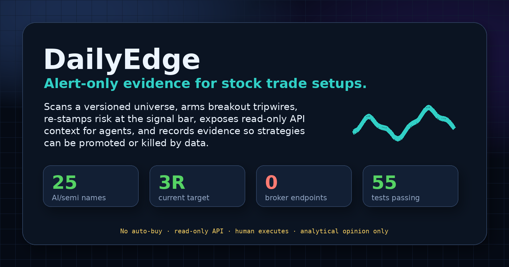
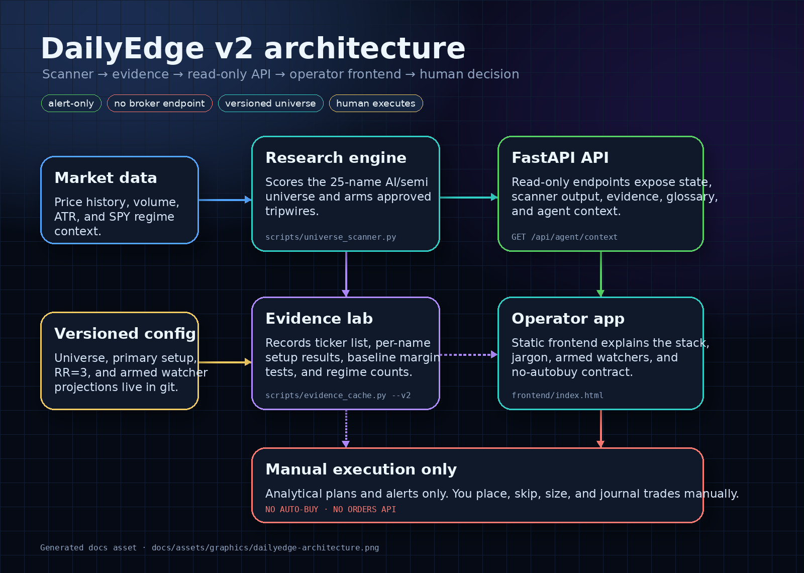
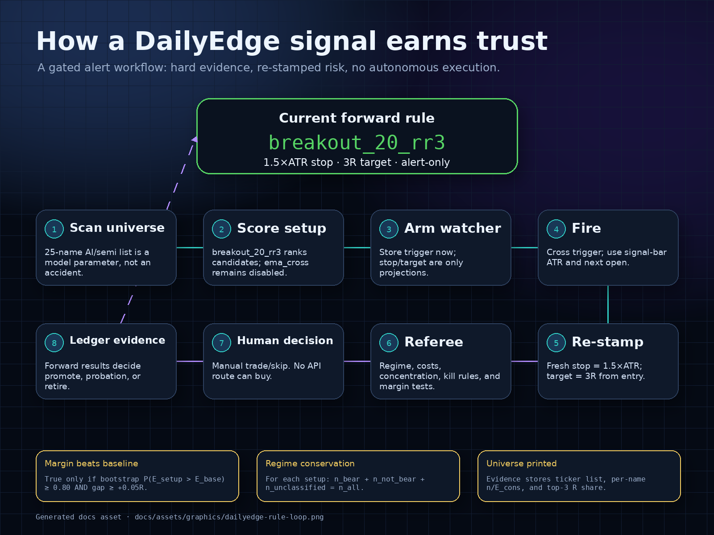
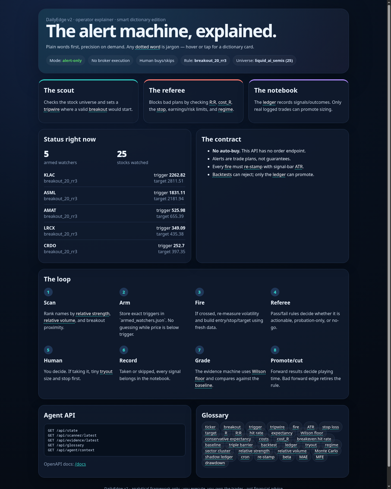
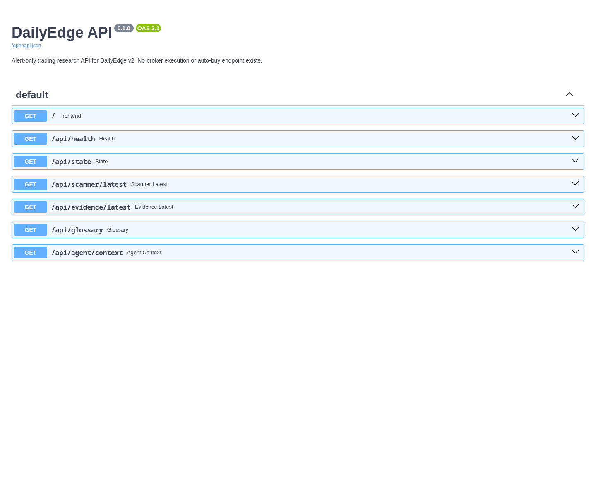

# DailyEdge



DailyEdge is an **alert-only trading research stack** for finding, validating, and journaling stock trade setups. It scans a versioned ticker universe, arms exact trigger levels, checks evidence and risk rules, exposes a read-only API for agents/frontends, and records outcomes so rules can earn trust or get killed by data.

> **Safety contract:** DailyEdge does **not** auto-buy, does **not** place broker orders, and does **not** provide financial advice. It produces analytical trade plans and alerts only. A human decides whether to place, skip, size, and journal every trade.

---

## What this does

DailyEdge turns a trading idea into a controlled evidence loop:

1. **Define the universe** — the ticker list is a versioned model parameter, not an invisible filter.
2. **Scan for candidates** — rank liquid AI/semi names by setup quality, trend, relative strength, volume, and proximity to trigger.
3. **Arm watchers** — write exact tripwire levels to `config/armed_watchers.json`.
4. **Wait for the trigger** — no guessing before price crosses the armed level.
5. **Re-stamp at fire** — when a trigger fires, recompute risk using signal-bar ATR and next-open entry.
6. **Referee the setup** — reject weak setups with regime, costs, concentration, evidence, and kill-criterion checks.
7. **Human decides** — DailyEdge gives the plan; the operator executes or skips manually.
8. **Journal + grade** — forward outcomes update the ledger and evidence so rules can be promoted, kept on probation, or retired.

The current live forward experiment is **`breakout_20_rr3`**:

- **Setup:** 20-day breakout tripwire
- **Stop:** 1.5× ATR
- **Target:** 3R
- **Execution:** alert-only, human-entered
- **Important:** stored watcher stop/target values are projections and must be re-stamped when a signal actually fires

---

## Visual overview

### Architecture



### Signal trust loop



---

## Screenshots

### Operator frontend

The frontend is a static operator explainer with a smart glossary, current rule/universe state, armed watchers, the no-auto-buy contract, and agent API links.



### OpenAPI docs

The FastAPI app exposes read-only endpoints for the UI and for agents.



---

## Current stack state

- **Universe:** `liquid_ai_semis`
- **Universe size:** 25 AI/semi/liquid tech names
- **Primary setup:** `breakout_20_rr3`
- **Risk shape:** 1.5× ATR stop, 3R target
- **Mode:** `alert_only`
- **Auto-buy:** disabled / not implemented
- **API:** FastAPI read-only interface
- **Frontend:** static HTML operator UI served by FastAPI
- **Generated outputs:** stored in `output/` and ignored by git except `.gitkeep`
- **Runtime journal:** stored in `journal/` and ignored by git except `.gitkeep`

---

## Repository layout

```text
api/                  FastAPI app exposing read-only state/evidence/scanner endpoints
config/               Versioned scanner, universe, tactic, and armed watcher config
docs/                 Architecture docs, API docs, operator guide, use cases
docs/assets/          README screenshots and graphics
docs/usecases/        Practical operator/agent workflows
frontend/             Static DailyEdge operator explainer UI
journal/              Runtime trading journal area, ignored except .gitkeep
output/               Generated scanner/evidence/report artifacts, ignored except .gitkeep
scripts/              Scanner, evidence, report, model, risk, and watcher scripts
state/journey/        Development log and implementation journey notes
tests/                Regression, evidence, API, scanner, and model tests
Dockerfile            Container image for API + frontend + scripts
docker-compose.yml    Local Docker runner
```

---

## Quick start: local Python

```bash
# Run from the repository root.
python3 -m venv .venv
. .venv/bin/activate
pip install -r requirements.txt

pytest -q
uvicorn api.main:app --host 0.0.0.0 --port 8000
```

Open:

- Frontend: <http://localhost:8000/>
- OpenAPI docs: <http://localhost:8000/docs>
- Health: <http://localhost:8000/api/health>
- State: <http://localhost:8000/api/state>
- Agent context: <http://localhost:8000/api/agent/context>

---

## Quick start: Docker

```bash
# Run from the repository root.
docker compose up --build
```

The container serves:

- `GET /` — frontend
- `GET /docs` — OpenAPI UI
- `GET /api/*` — read-only API

Mounted runtime folders:

```text
./output  -> /app/output
./journal -> /app/journal
./config  -> /app/config
```

This keeps generated outputs and local operating state outside the image.

---

## Core commands

Run these from the repository root.

```bash
# Run the DailyEdge scanner with the configured universe/rule
python3 scripts/universe_scanner.py

# Refresh evidence v2
python3 scripts/evidence_cache.py --v2

# Build a full ticker report
python3 scripts/full_ticker_report.py KLAC

# Intraday/session model
python3 scripts/intraday_session_model.py KLAC --period 10d --interval 15m --opening-range-minutes 60

# Multi-timeframe model
python3 scripts/multi_timeframe_model.py KLAC --horizon 5 --min-samples 20 --validation walk-forward --embargo-bars 5

# Test the repo
pytest -q
```

Convenience wrappers:

```bash
scripts/run_daily_scan.sh
scripts/run_weekly_evidence.sh
```

---

## API surface

DailyEdge's API is intentionally read-only. It is built for dashboards and agents to inspect state, not to trade.

| Endpoint | Purpose |
|---|---|
| `GET /` | Serve the operator frontend |
| `GET /api/health` | Health check and alert-only mode proof |
| `GET /api/state` | Current universe, rule, armed watchers, and summary evidence state |
| `GET /api/scanner/latest` | Latest scanner output from `output/universe_scanner_latest.json` |
| `GET /api/evidence/latest` | Latest evidence output from `output/evidence_v2.json` |
| `GET /api/glossary` | Jargon dictionary used by the frontend |
| `GET /api/agent/context` | Machine-readable contract/capabilities for agents |

There is no `POST /orders`, no broker integration, and no autonomous execution route.

---

## How agents should use this stack

Agents should treat DailyEdge as a local, auditable research service:

1. Call `GET /api/agent/context` to read the safety contract and available capabilities.
2. Call `GET /api/state` to identify the current universe, setup, and armed watchers.
3. Call `GET /api/scanner/latest` and `GET /api/evidence/latest` if generated outputs exist.
4. Run scripts directly when fresh data is needed.
5. Summarize alerts as **analytical trade plans**, not guaranteed recommendations.
6. Never claim an order was placed; no broker endpoint exists.
7. If a watcher fires, re-stamp with signal-bar ATR and next-open entry before journaling.

The agent context endpoint is deliberately explicit about this contract:

```json
{
  "contract": {
    "no_auto_buy": true,
    "human_executes_orders": true,
    "alerts_are_trade_plans_not_advice": true,
    "restamp_required_at_fire": true
  }
}
```

---

## Evidence philosophy

DailyEdge is designed to prevent single-pipeline overfitting.

Evidence artifacts should record:

- exact ticker universe used
- per-setup aggregate results
- per-name `n` and conservative expectancy
- baseline comparison using a margin test, not a naked `>` sign
- top-3 ticker share of total R to detect concentration
- regime counts that conserve signal totals
- failed/unscored tickers, with reasons

Rules are allowed to be boring. If the edge is concentrated in a few monster names or disappears when the universe changes, the rule stays on probation or gets disabled.

---

## Operator workflow

A normal operating loop looks like this:

```bash
# 1. Refresh evidence periodically
python3 scripts/evidence_cache.py --v2

# 2. Scan daily
python3 scripts/universe_scanner.py

# 3. Inspect the frontend/API
uvicorn api.main:app --host 0.0.0.0 --port 8000

# 4. If a watcher fires, re-stamp before action
python3 scripts/watcher_ingest.py

# 5. If considering a ticker, build the report
python3 scripts/full_ticker_report.py KLAC
```

After a trade is taken or skipped, write it to the forward journal/ledger. Backtests can reject rules; only real forward outcomes can promote sizing.

---

## Docs and state journey

The repo keeps documentation and development history next to the code:

- `docs/ARCHITECTURE.md` — system design
- `docs/API.md` — API contract
- `docs/OPERATOR_GUIDE.md` — operator workflow
- `docs/usecases/` — practical use-case flows
- `state/journey/` — chronological development notes and implementation history

Use `state/journey/` for durable build decisions and changes in direction. Do not use it for noisy generated artifacts.

---

## Git hygiene

Tracked:

- code
- tests
- docs
- versioned config
- README graphics/screenshots
- `.gitkeep` placeholders for runtime folders

Ignored:

- `output/*` generated scanner/evidence/report files
- `journal/*` runtime journal entries
- Python caches and test caches
- virtualenvs
- local secrets and `.env` files
- logs, pids, local DB/cache files

This keeps the repository reproducible without leaking generated market output or local credentials.

---

## README graphics maintenance

README graphics are generated by a deterministic renderer that measures every text block against its card before writing PNGs. This prevents text from spilling outside boxes when the images render on GitHub.

```bash
# Regenerate hero/architecture/rule-loop graphics
python3 scripts/render_readme_assets.py

# Validate layout without writing files; fails if any text block overflows
python3 scripts/render_readme_assets.py --check
```

The test suite runs this layout check through `tests/test_readme_assets.py`, so future README graphic changes should fail CI if boxes/text overflow again.

---

## Testing

```bash
pytest -q
```

Current verified count at the time of this README update:

```text
55 passed
```

---

## Disclaimer

DailyEdge is an analytical research and alerting tool. It is not financial advice, it does not guarantee outcomes, and it does not execute trades. Use paper-trade assumptions unless a human operator explicitly decides otherwise.